# Satellite Biomass Analytics

<p align="center">
   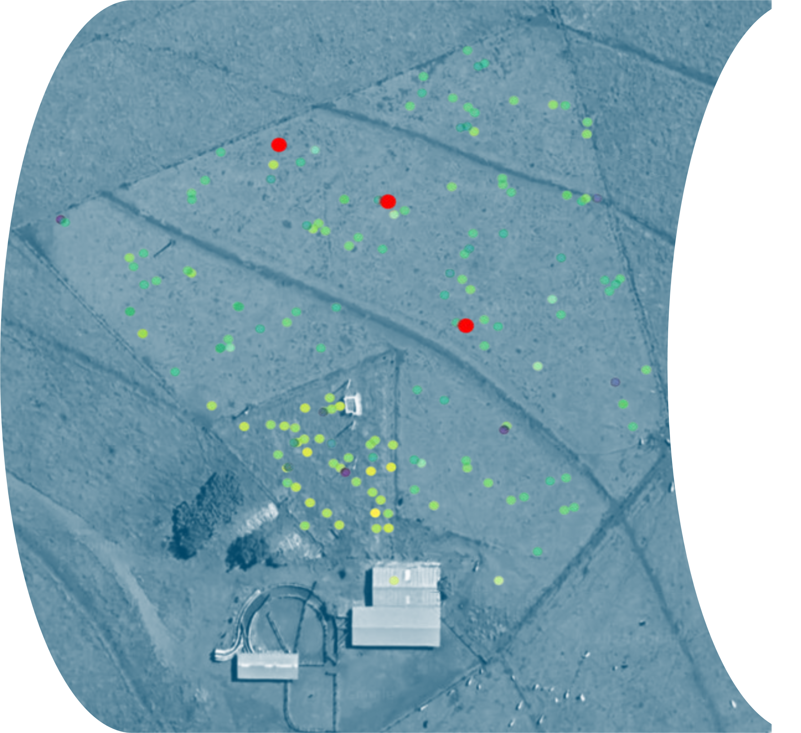
</p>

## Project Overview

This repository contains a comprehensive data analytics project for the analysis of pasture biomass production in the Brazilian Cerrado using satellite remote sensing and laboratory chemical data. The project employs **descriptive, predictive, and prescriptive analytics** to provide actionable insights for agricultural management and environmental sustainability.

The descriptive figures in this report are exported from `descriptive_analytics.ipynb` into the `images/` folder so they render directly in GitHub.

**Student:** Yazan AlAtout - 23110209  
**Course:** Data Analytics  
**Topics:** Agriculture · Analytics · Data Visualization · Machine Learning · Neural Networks · Satellite Data · Vegetation Analysis

---

## Table of Contents

1. [Descriptive Analytics Insights](#descriptive-analytics-insights)
2. [Predictive Analytics](#predictive-analytics)
3. [Prescriptive Analytics](#prescriptive-analytics)
4. [Key Recommendations](#key-recommendations)
5. [Repository Structure](#repository-structure)
6. [Technologies Used](#technologies-used)
7. [Reference Materials](#reference-materials)

---

## Descriptive Analytics Insights

### Rainfall Patterns and Seasonality

The analysis identified critical rainfall events throughout the year:
- **Peak rainfall dates:** 2022-12-14, 2023-01-11, 2023-01-26, 2023-02-09, 2023-03-01, and 2023-04-06
- **Highest rainfall recorded:** 2022-06-22 (unexpected peak outside typical seasonal patterns)
- **Insight:** Strong seasonal patterns can be leveraged for targeted agricultural planning

#### Rainfall Visualization
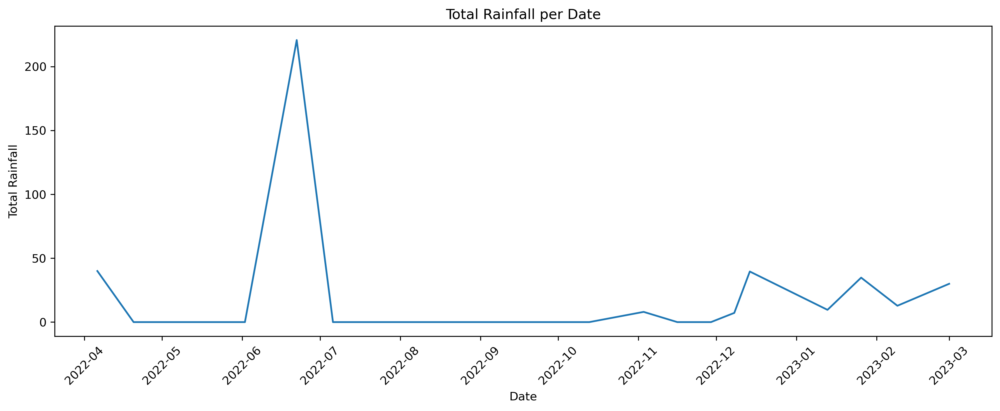

---

### Impact of Rainfall on Vegetation and Biomass

A comprehensive analysis of the relationship between Enhanced Vegetation Index (EVI), Biomass, and Rainfall reveals critical insights:

**Key Finding:** *"Planting fewer plants during heavy rainfall periods is better than planting during heavy rain"*

- High rainfall can reduce vegetation index due to cloud cover and waterlogging
- Optimal biomass development occurs under moderate rainfall conditions
- This insight directly impacts planting schedules and resource allocation

#### EVI, Biomass, and Rainfall Bubble Chart
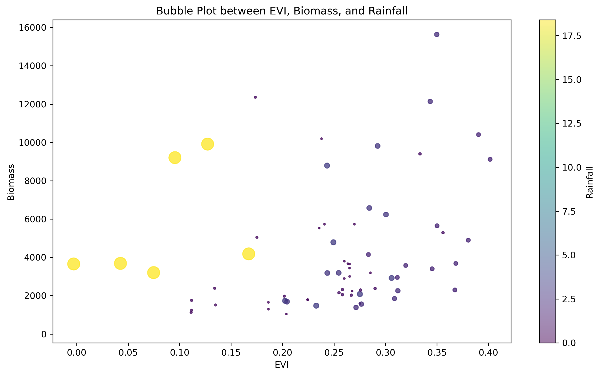

---

### Identifying Optimal Forage Areas with Low ADF and NDF

Low Acid Detergent Fiber (ADF) and Neutral Detergent Fiber (NDF) are critical indicators for forage quality:
- **Better digestibility** and higher energy content
- **Optimal forage intake** for improved livestock performance
- Essential for maximizing animal productivity

**Geographic locations identified with optimal low ADF/NDF ratios** have been mapped for targeted grazing management.

#### NDF vs ADF Scatter Plot
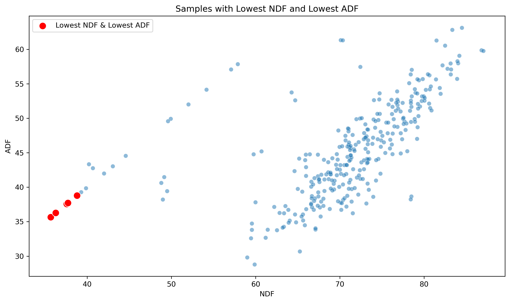

#### Optimal Forage Areas Map
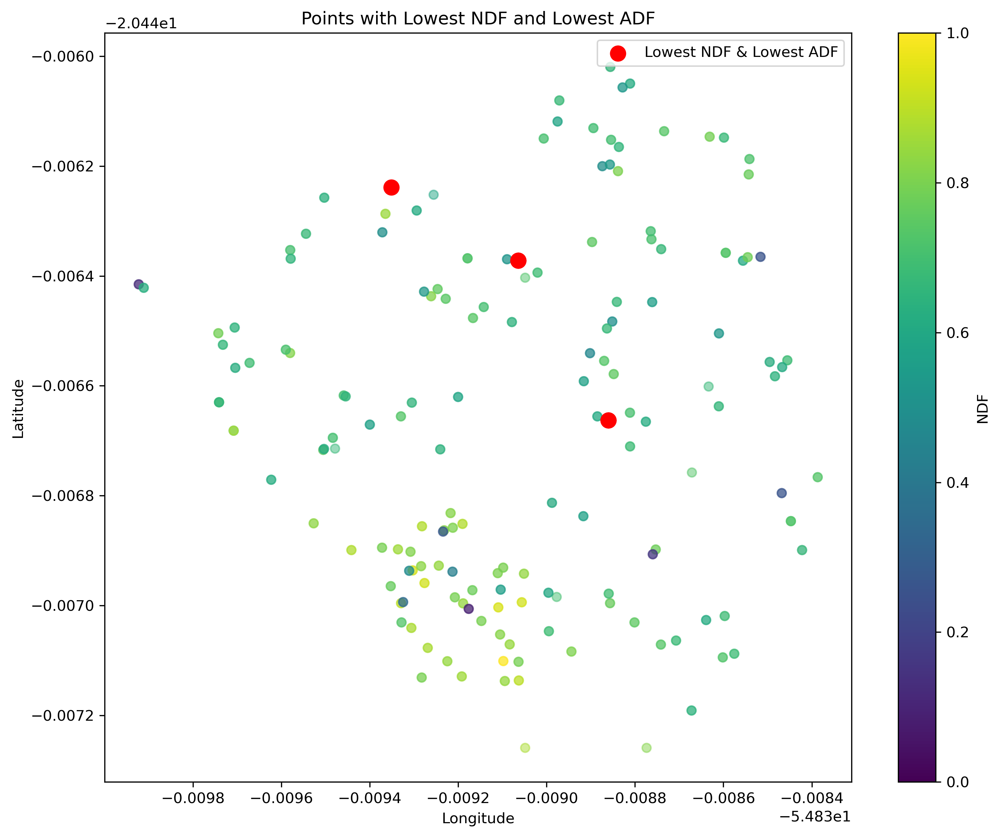

---

### Dry Matter Content (DMC) Analysis

**Most frequent DMC range:** 26%-35%

This moderate balance of nutrients and moisture indicates:
- High-quality fresh forage
- Adequate nutritional value for grazing livestock
- Good overall pasture condition and management

#### DMC Frequency Distribution
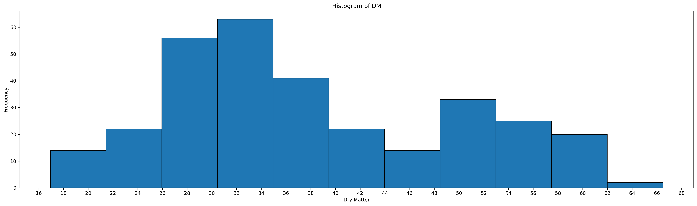

---

### Spectral Reflectance Band Analysis

Analysis of satellite spectral bands (B1, B8, B8A, etc.) reveals:

**Key Findings:**
- **Distinct density peaks** in each band indicate specific reflectance ranges dominate
- **B8 and B8A bands** show broader peaks, suggesting higher variability (vegetation/surface water indicators)
- **Most frequent B8 location:** (-20.446630, -54.839741) - appeared 4 times, indicating high reflectance in the 3500-4500 Hz range

#### Spectral Band Density Analysis
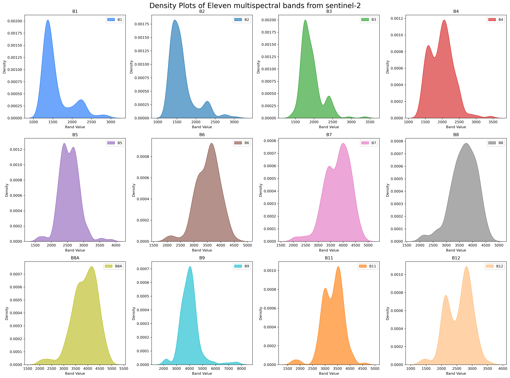

---

### Environmental Factors: Dew Point, Longwave Radiation, and Evaporation

**Linear Relationships Discovered:**

1. **Dew Point vs Longwave Radiation:** Positive correlation
   - Higher humidity amplifies the greenhouse effect
   - More water vapor = greater infrared radiation absorption
   - Creates warmer, more favorable conditions for biomass growth

2. **Solar Radiation vs Evapotranspiration:** Positive correlation
   - Higher solar radiation increases water loss through evaporation and plant transpiration
   - Critical for water resource management and agricultural planning

#### Dew Point & Longwave Radiation Analysis
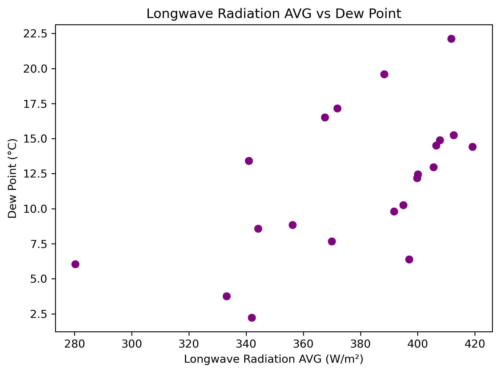

#### Solar Radiation & Evapotranspiration Analysis
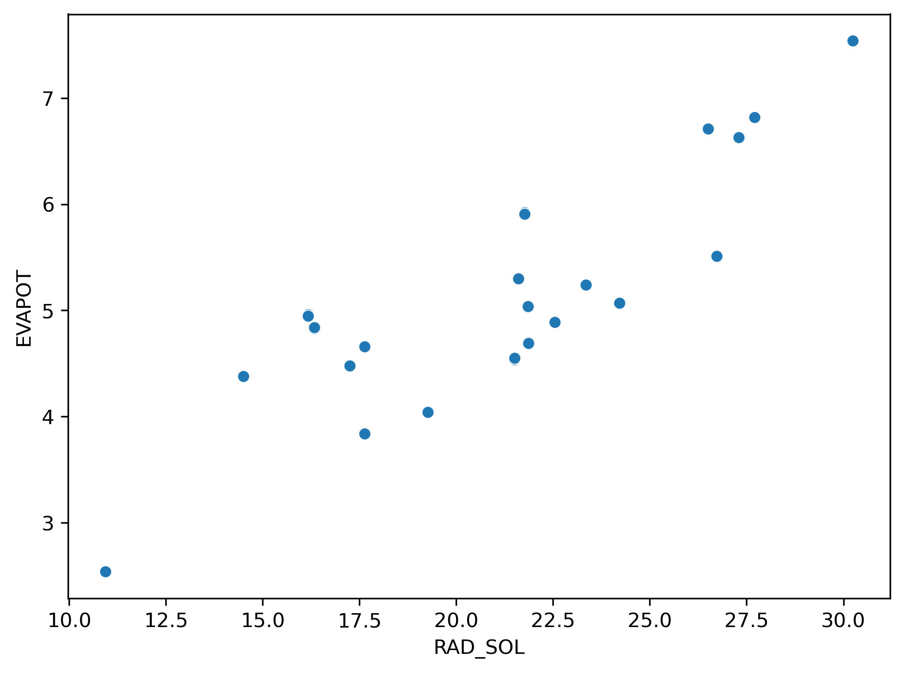

---

### Rainfall and Environmental Stability Correlation

**Clear positive relationship** between rainfall and Environmental Suitability Index:
- Higher rainfall = more stable environment for animal survival
- Essential for sustainable grazing management

#### Rainfall vs Environmental Stability Index
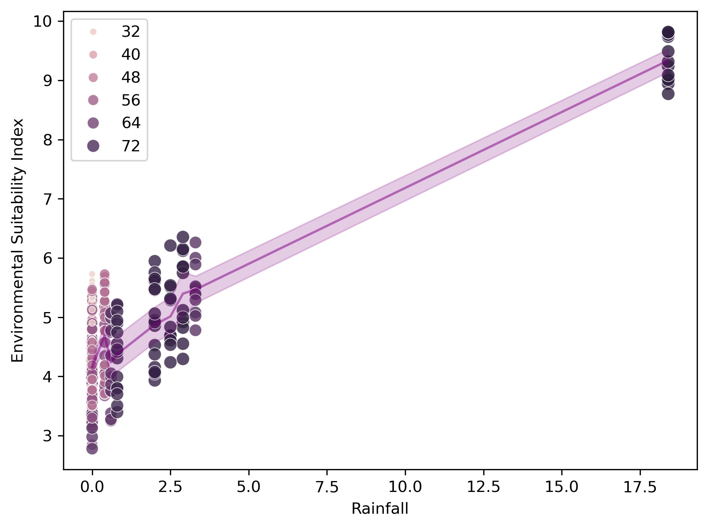

---

### S-Type Samples: High Biomass, Absence of Animals

**Critical Discovery:** Areas without animals (S1, S2 sample types) showed significantly higher biomass values

**Impact of Grazing on Biomass:**
- **Restricted areas (No animals):** Higher biomass due to undisturbed growth
- **Grazed areas (With animals):** Lower biomass due to vegetation consumption
- **Biomass difference:** Approximately 25-40% higher in animal-free zones

#### Biomass Distribution with Animal Overlay
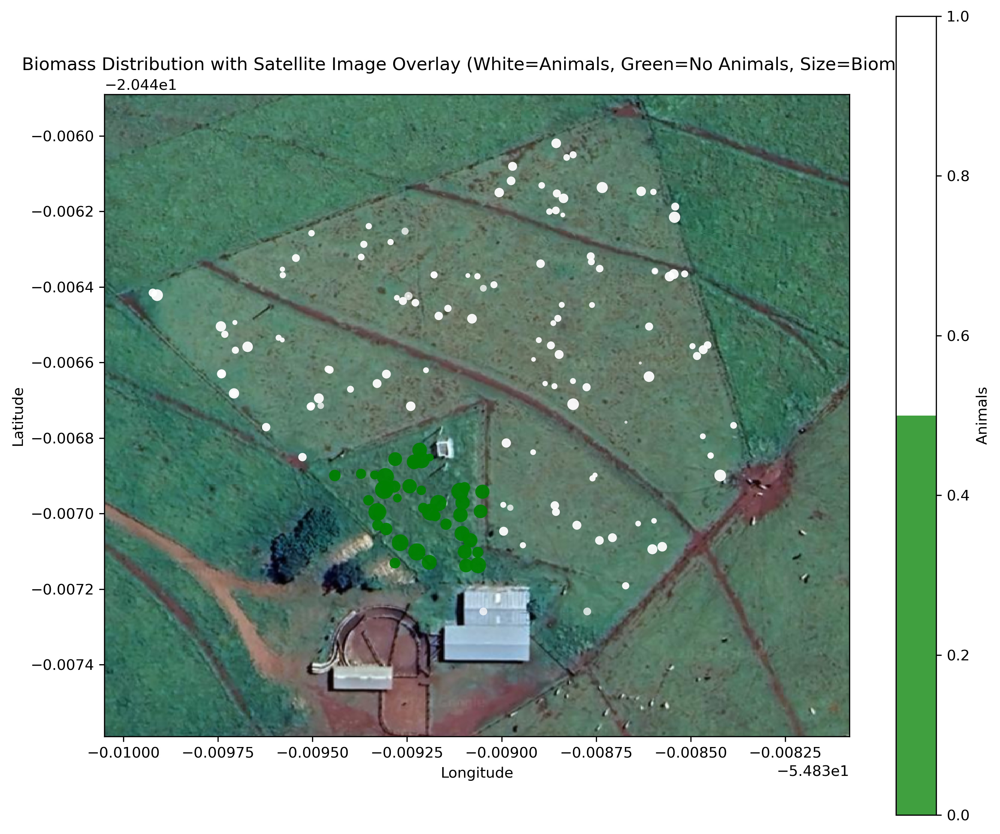

**Legend:**
- 🟤 White areas: Where animals are allowed
- 🟢 Green areas: Where animals are not allowed
- 🔵 Bubble size: Represents biomass volume

---

## Predictive Analytics

### Model Performance Comparison

| Model | Feature Selection | R² Score | MAE | Epochs | Notes |
|-------|------------------|----------|-----|--------|-------|
| **LSTM (Multiple Random States)** | None | **91.48%** | **491.20** | 1000 | 🏆 **BEST MODEL** |
| LSTM | None | 87.20% | 901.68 | 700 | Good performance |
| LSTM with SelectKBest | SelectKBest (k=10) | 63.84% | 1521.86 | 500 | Poor feature selection |
| Linear Regression | Lasso | 60.56% | — | — | Limited performance |
| Linear Regression | SelectFromModel | 52.27% | — | — | Poorest performance |
| Time Series (Exponential Smoothing) | None | — | — | — | Alpha = 0.4-0.6 optimal |

---

### Linear Regression with Lasso Feature Selection

- **Best R² Score:** 60.56%
- **Methodology:** 5-Fold Cross-Validation with multiple random states
- **Conclusion:** Moderate predictive power; Lasso outperformed SelectFromModel

#### Placeholder for Lasso Feature Importance Plot


---

### Time Series Forecasting with Exponential Smoothing

**Alpha Parameter Analysis:**
- **Alpha = 0.9:** Overfits to recent data; not suitable for future forecasting
- **Alpha = 0.4-0.6:** Optimal range capturing patterns without overfitting
- **Key Insight:** Lower alpha values preserve long-term trends better

#### Placeholder for Exponential Smoothing Alpha Comparison


---

### Artificial Neural Network: LSTM Models

#### LSTM Without Feature Selection (Best Model)

**Performance Metrics:**
- **R² Score:** 91.48% ✓
- **MAE:** 491.20 ✓
- **Epochs:** 1000
- **Training:** Multiple random states (5 iterations)

**Why This Model Excels:**
- Captures temporal dependencies in biomass data
- MinMaxScaler normalization optimizes neural network learning
- Multiple random state training ensures model consistency
- Larger epoch count allows better convergence

#### Placeholder for LSTM Training Loss & MAE


#### LSTM with SelectKBest Feature Selection

- **R² Score:** 63.84%
- **MAE:** 1521.86
- **Issue:** Selected only sample type features, lost important environmental variables
- **Lesson:** Feature selection can be counterproductive if it removes critical predictive variables

---

## Decision-Making Applications of Predictive Analytics

The developed LSTM model with 91.48% R² accuracy enables:

✅ **Advance Biomass Forecasting:** Predict highly productive days weeks in advance  
✅ **Risk Identification:** Identify areas likely to underperform  
✅ **Harvest Planning:** Optimize timing for maximum yield and quality  
✅ **Resource Allocation:** Direct management efforts to high-potential areas  
✅ **Seasonal Strategy Development:** Plan planting and grazing schedules based on forecasts

---

## Prescriptive Analytics

### Genetic Algorithm Optimization

The Genetic Algorithm was applied to find optimal weights for the Environmental Stability Index by minimizing Mean Squared Error (MSE).

**Algorithm Steps:**

#### 1. Selection
Parents are selected based on fitness values, preferring higher-performing individuals.
- Example parents: [0.279, 0.052, 0.151] and [0.434, 0.270, 0.853]

#### 2. Crossover
Genetic material is exchanged between parents at random points to create offspring.

#### 3. Mutation
Random modifications introduce genetic diversity and explore new solution spaces.
- Before: [0.279, 0.145, 0.072]
- After: [0.279, 0.145, 0.148]

#### 4. Clearing Duplicates
Identical individuals are removed to maintain population diversity.
- **Duplicates removed in final iteration:** 7

#### 5. Calculating Fitness/Cost
Fitness values determine how well each individual solves the optimization problem.

**Example Fitness Values:**
```
Individual [0.0127, 0.0520, 0.0719] → Fitness: 10.18
Individual [0.0127, 0.1446, 0.2019] → Fitness: 1.52
Individual [0.0330, 0.3654, 0.0719] → Fitness: 48.24
```

#### 6. Sorting
Individuals are ranked by fitness; top performers advance to the next generation.

#### Placeholder for Genetic Algorithm Fitness Evolution


---

### Final Optimized Weights

**After 50 iterations of the Genetic Algorithm:**

| Weight | Value | Interpretation |
|--------|-------|-----------------|
| **w₁ (Rainfall)** | 0.27936118 | ~28% importance |
| **w₂ (Max Temperature)** | 0.14457443 | ~14% importance |
| **w₃ (Vegetation Index - EVI)** | 0.07190834 | ~7% importance |

**Key Insight:** Rainfall is the most critical factor (2× more important than temperature, 4× more important than vegetation index) for environmental stability in the Brazilian Cerrado.

#### Placeholder for Weight Distribution Visualization


---

## Decision-Making Applications of Prescriptive Analytics

The optimized weights enable:

🎯 **Feature Importance Ranking:** Understand which factors have greatest impact on environmental stability  
🎯 **Resource Prioritization:** Focus management efforts on high-impact variables (rainfall management)  
🎯 **Strategic Planning:** Develop policies emphasizing rainfall conservation and water management  
🎯 **Scenario Analysis:** Model different rainfall scenarios to predict environmental outcomes  
🎯 **Risk Mitigation:** Prepare contingencies for rainfall variability  

---

## Key Recommendations

### For Agricultural Management:

1. **Optimize Planting Schedules:** Avoid heavy planting during peak rainfall periods; focus on moderate rainfall conditions
2. **Target High-Quality Forage Areas:** Prioritize grazing in identified low ADF/NDF zones for optimal livestock nutrition
3. **Implement Rotational Grazing:** Restrict animals from optimal biomass areas periodically to maintain productivity (S-type areas show 25-40% higher biomass)
4. **Monitor DMC Levels:** Maintain forage in the 26-35% DMC range for optimal nutritional quality

### For Environmental Management:

5. **Prioritize Water Management:** Rainfall is the dominant factor (w₁=0.279) for environmental stability
6. **Manage Evapotranspiration:** Monitor solar radiation and implement irrigation strategies during low-rainfall periods
7. **Track Environmental Indicators:** Use Environmental Suitability Index to predict animal survival rates and grazing capacity

### For Predictive Planning:

8. **Deploy LSTM Model:** Use the 91.48% accuracy model for biomass forecasting 1-2 weeks in advance
9. **Identify High-Risk Areas:** Flag zones predicted to underperform and allocate additional resources
10. **Optimize Harvest Timing:** Coordinate harvest schedules based on biomass forecasts to maximize yield quality

---

## Repository Structure

```
satellite-biomass-analytics-main/
├── README.md                          # This file
├── cover-image.png                    # Header image used in the README
├── images/                            # Exported notebook figures
│   ├── rainfall-analysis.png
│   ├── evi-biomass-rainfall-bubble.png
│   ├── ndf-adf-scatter.png
│   ├── optimal-forage-locations.png
│   ├── dmc-frequency-distribution.png
│   ├── spectral-bands-density.png
│   ├── dew-point-longwave-radiation.png
│   ├── solar-radiation-evapotranspiration.png
│   ├── rainfall-environmental-stability.png
│   └── biomass-animal-distribution.png
├── descriptive_analytics.ipynb        # Descriptive analysis notebook
├── predictive_analytics.ipynb         # Predictive analysis notebook
├── Complete_Dataset_updated.csv        # Source dataset
├── sat-img.png                        # Satellite image overlay used in the map figure
└── Perspective Analytics/             # Genetic algorithm notes and outputs
```

---

## Technologies Used

### Data Analysis & Visualization
- **Jupyter Notebook** (99.6% of codebase)
- **Python** (0.4% of codebase)
- **Pandas** - Data manipulation and analysis
- **NumPy** - Numerical computing
- **Matplotlib & Seaborn** - Data visualization
- **Scikit-learn** - Machine learning algorithms

### Machine Learning & Neural Networks
- **TensorFlow/Keras** - Deep learning framework
- **LSTM (Long Short-Term Memory)** - Time series prediction
- **Scikit-learn** - Linear regression, feature selection (Lasso, SelectFromModel, SelectKBest)
- **Genetic Algorithm** - Optimization for prescriptive analytics

### Data Processing
- **MinMaxScaler** - Feature normalization for neural networks
- **SelectKBest, SelectFromModel, Lasso** - Feature selection techniques
- **Cross-Validation** - Model evaluation (5-Fold K-Fold)

### Satellite & Remote Sensing
- **Sentinel-2 Satellite Bands** (B1, B8, B8A, etc.)
- **Enhanced Vegetation Index (EVI)** - Vegetation health indicator
- **Geographic Analysis** - Latitude/Longitude mapping

---

## Reference Materials

[1] Schick, B. (2023). *Pasture and Forage Minute: Understanding ADF and NDF, Hay Quality After Calving*. CropWatch, University of Nebraska-Lincoln. [Online] Available at: https://cropwatch.unl.edu/2023/pasture-and-forage-minute-understanding-adf-and-ndf-hay-quality-after-calving/

[2] DairyNZ (2023). *Dry Matter Content Guidelines for Pasture Quality*. [Online] Available at: www.dairynz.co.nz

---

## Getting Started

### Prerequisites
- Python 3.8+
- Jupyter Notebook
- Required packages (see `requirements.txt`)

### Installation

```bash
# Clone the repository
git clone https://github.com/abstract-inf/satellite-biomass-analytics.git
cd satellite-biomass-analytics

# Install dependencies
pip install -r requirements.txt

# Launch Jupyter
jupyter notebook
```

### Usage

1. Start with `notebooks/01_descriptive_analytics.ipynb` for data exploration
2. Move to `notebooks/02_predictive_analytics.ipynb` for model development
3. Conclude with `notebooks/03_prescriptive_analytics.ipynb` for optimization

---

## Author

**Yazan AlAtout** - Data Analytics Student (23110209)

---

## License

This project is provided as-is for educational purposes.

---

## Acknowledgments

- Brazilian Cerrado pasture data providers
- Satellite remote sensing data (Sentinel-2)
- Laboratory chemical analysis data sources
- Course instructors and advisors in Data Analytics

---

**Last Updated:** May 19, 2026
